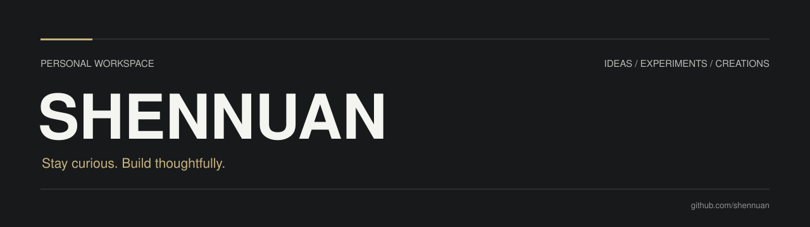

把想法做成作品，把探索留成记录。

<a href="https://github.com/shennuan?tab=repositories">Repositories</a> &nbsp; / &nbsp; <a href="https://github.com/shennuan?tab=stars">Discoveries</a>

 

### A space to explore

这里收集我的学习记录、代码实验与逐步成形的作品。 
从一个小问题开始，在实践中理解，在迭代中完善。

 

| 01 / LEARN | 02 / EXPERIMENT | 03 / BUILD |
| :--- | :--- | :--- |
| **理解原理** | **验证想法** | **打磨作品** |
| 记录问题与思考，让知识形成联系。 | 从小实验开始，用实践检验直觉。 | 关注细节，让想法成为可用的成果。 |

 

### Work in progress

新的作品正在积累中。完成并整理后，会在这里展示。

---

SMALL STEPS. THOUGHTFUL WORK. CONTINUOUS DISCOVERY.

